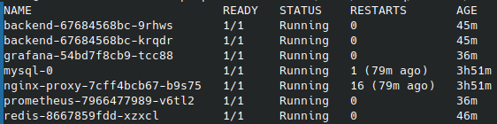
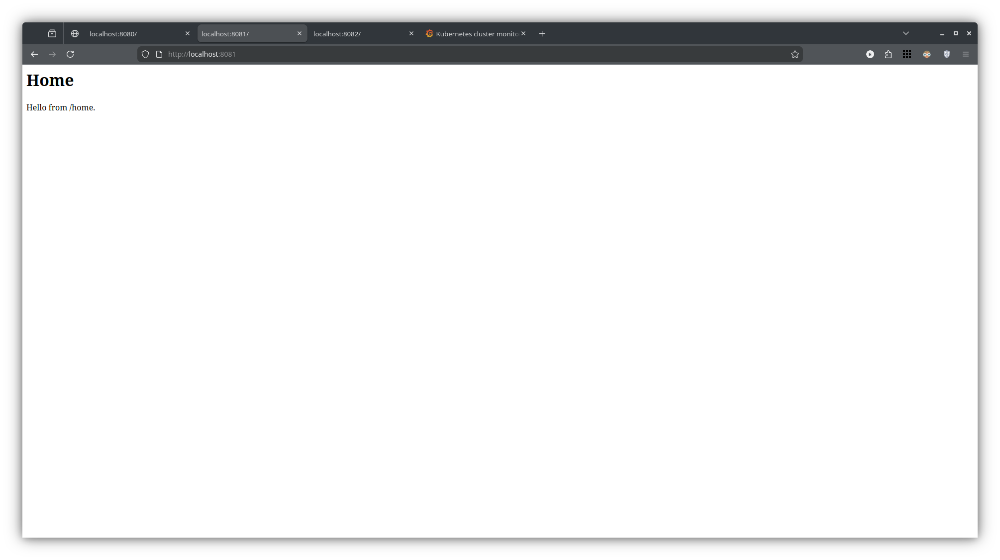
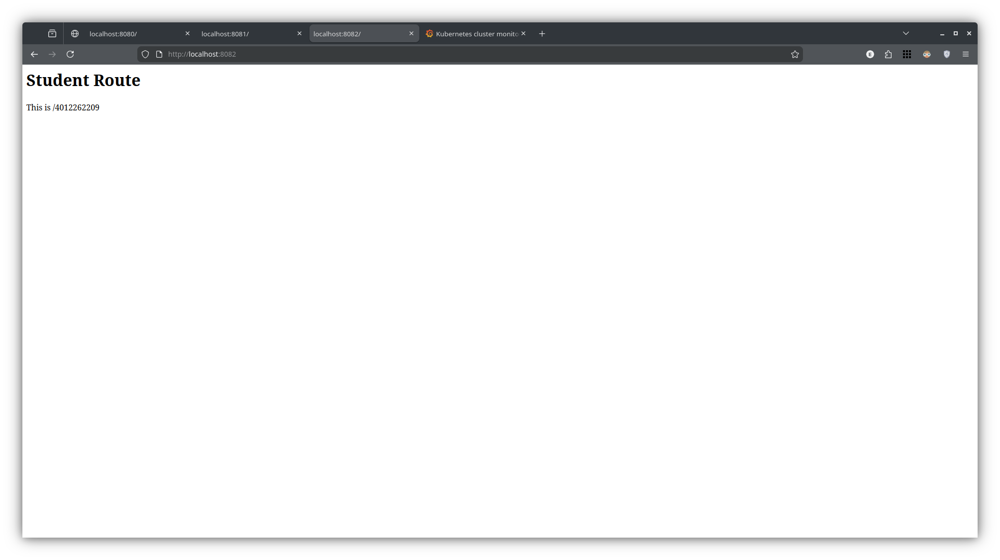
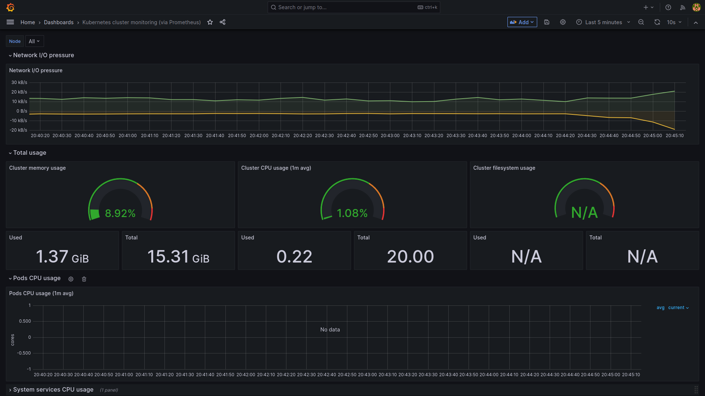

# 🧭 مستندات پروژه کوبرنتیز

## 📋 معرفی پروژه
این پروژه شامل مهاجرت یک اپلیکیشن سه لایه **(Web, App, DB)** از محیط **Docker Compose** به ارکستراتور **Kubernetes** است.  
پیاده‌سازی بر روی کلاستر محلی **Kind** انجام شده و تمامی نیازمندی‌های پروژه شامل موارد اجباری و اختیاری **(Redis, NetworkPolicy, Monitoring)** پیاده‌سازی شده‌اند.

---

## 📂 ساختار فایل‌ها
طبق خواسته پروژه، فایل‌های YAML بر اساس وظیفه و نوع سرویس در پوشه‌های مجزا دسته‌بندی شده‌اند:

```text
k8s/
├── base/           # تنظیمات زیرساختی (Namespace, Manual PV)
├── db/             # تنظیمات دیتابیس (StatefulSet, Service, Secret)
├── backend/        # تنظیمات اپلیکیشن (Deployment, ConfigMap, HPA)
├── nginx/          # تنظیمات وب‌سرور (ConfigMap, Deployment, Service)
├── redis/          # تنظیمات کش (Deployment, Service)
├── security/       # سیاست‌های امنیتی شبکه (NetworkPolicy)
└── monitoring/     # مانیتورینگ (Prometheus, Grafana, RBAC)
```
---

## 🚀 راهنمای نصب و اجرا

### 1. پیش‌نیازها

برای اجرای پروژه نیاز به ابزارهای زیر دارید:

* Docker
* Kind
* Kubectl

---

### 2. آماده‌سازی کلاستر و ایمیج

ابتدا کلاستر را ایجاد کرده و ایمیج اپلیکیشن را بیلد می‌کنیم.
**نکته مهم** در Kind این است که باید ایمیج را پس از ساخت، در نودهای کلاستر بارگذاری کنیم:

```bash
# ایجاد کلاستر
kind create cluster --name my-project

# ساخت ایمیج اپلیکیشن (در روت پروژه)
docker build -t my-app:1.0 ./app

# بارگذاری ایمیج در کلاستر Kind
kind load docker-image my-app:1.0 --name my-project
```

---

### 3. اجرای سرویس‌ها

برای اعمال تمام فایل‌های کانفیگ به صورت یکجا و رعایت ساختار پوشه‌بندی:

```bash
kubectl apply -f k8s/ --recursive
```

---

### 4. بررسی وضعیت

برای اطمینان از صحت اجرا:

```bash
kubectl get pods -n user-system
```

> تمامی پادهای دیتابیس، بک‌اند، انجین‌اکس و سرویس‌های مانیتورینگ باید در وضعیت **Running** باشند.



---

## 🔗 نحوه اتصال سرویس‌ها

در این پروژه از **DNS داخلی Kubernetes (CoreDNS)** برای ارتباط سرویس‌ها استفاده شده است:

| سرویس مبدأ              | سرویس مقصد                                 | توضیح                     |
| ----------------------- | ------------------------------------------ | ------------------------- |
| **Nginx ➡️ Backend**    | `app.user-system.svc.cluster.local:5000`   | هدایت درخواست‌های کاربران |
| **Backend ➡️ Database** | `mysql-0.db.user-system.svc.cluster.local` | اتصال پایدار StatefulSet  |
| **Backend ➡️ Redis**    | `redis.user-system.svc.cluster.local`      | مدیریت کش و داده موقت     |

🔒 **امنیت شبکه:**
با NetworkPolicy فقط پادهای **backend** اجازه اتصال مستقیم به **DB** و **Redis** را دارند.

---

## 🛠 چالش‌ها و نحوه رفع اشکال

### 5. مشکل Pending ماندن دیتابیس (Issue مرتبط با PVC در Kind)

**مشکل:**
پاد `mysql-0` در وضعیت Pending باقی می‌ماند. Provisioner پیش‌فرض Kind قادر به اختصاص دیسک نبود.

**راه‌حل:**

* تعریف یک **PersistentVolume دستی** با HostPath
* ایجاد **StorageClass** با تنظیم:

```yaml
volumeBindingMode: Immediate
```

این کار باعث ساخت فوری Volume و رفع مشکل Pending شد.

---

### 6. مشکل DNS Resolution (CoreDNS Loop)

**مشکل:**
سرویس‌ها با خطای زیر مواجه بودند:

```
Host not found
```

و پاد `coredns` در وضعیت `0/1` قرار داشت. لاگ‌ها خطای `Loop detected` را نشان می‌دادند.

**راه‌حل:**

```bash
kubectl edit configmap coredns -n kube-system
```

* حذف پلاگین **loop**
* ریستارت CoreDNS
* فعال شدن سرویس نام‌گذاری و رفع مشکل ارتباط بین سرویس‌ها

---

## 🧪 نحوه تست پروژه

چون پروژه روی Kind اجرا می‌شود، برای تست از **Port Forwarding** استفاده می‌کنیم.

### 🌐 تست اپلیکیشن (Nginx)

```bash
kubectl port-forward service/nginx-service 8080:8000 -n user-system
```






مسیرهای قابل‌دسترسی در مرورگر:

| مسیر          | توضیح         |
| ------------- | ------------- |
| `/`           | صفحه اصلی     |
| `/home`       | صفحه خانه     |
| `/4012262209` | مسیر دانشجویی |

---

### 📊 مشاهده مانیتورینگ (Grafana)

```bash
kubectl port-forward service/grafana 3000:3000 -n user-system
```

* آدرس: [http://localhost:3000](http://localhost:3000)
* **User:** `admin`
* **Pass:** `admin123`



---

## 🏁 پایان گزارش

این پروژه با موفقیت مهاجرت اپلیکیشن Docker Compose به Kubernetes را همراه با مفاهیم کلیدی زیر پیاده‌سازی کرده است:

✔️ StatefulSet
✔️ Storage و Volume
✔️ NetworkPolicy
✔️ CoreDNS
✔️ Port Forwarding
✔️ Monitoring (Grafana + Prometheus)

---


